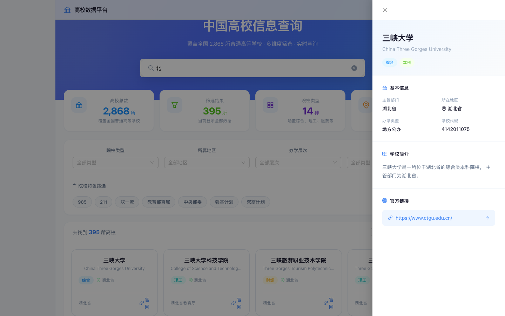

# 中国高校信息查询系统

基于教育部官方数据的现代化高校信息查询平台，提供多维度筛选、智能搜索、卡片/列表双视图等功能。

<p align="center">
  
</p>

<p align="center">
  
  &nbsp;&nbsp;
  
</p>

<p align="center">
  
  &nbsp;&nbsp;
  
</p>

## 功能特性

- **智能搜索** — 支持中英文校名、城市、标签关键词搜索，实时联想
- **多维筛选** — 院校类型 / 所属地区 / 办学层次 / 办学类型 / 院校特色（985、211、双一流等）
- **双视图** — 列表视图与卡片视图一键切换
- **详情抽屉** — 点击高校弹出侧栏详情，无需跳转页面
- **标签体系** — 统一胶囊风格标签，颜色语义化
- **响应式** — 桌面端 / 平板 / 移动端自适应

## 数据维度

| 维度 | 说明 | 示例 |
|------|------|------|
| 高校类型 | 学科类型 | 综合、理工、农林、医药、师范等 |
| 院校所属 | 所在地区 | 北京市、上海市、广东省等 |
| 办学层次 | 层次分类 | 本科、高职（专科） |
| 办学类型 | 院校性质 | 公办、民办、中外合作办学等 |
| 院校特色 | 特色标签 | 985、211、双一流、教育部直属、强基计划等 |

## 技术栈

| 层级 | 技术 |
|------|------|
| 前端框架 | React 19 |
| UI 组件 | Ant Design 6 |
| 构建工具 | Vite 8 |
| 数据处理 | Python 3 + Pandas |
| 数据来源 | 教育部《全国高等学校名单》2017–2025 |

## 快速开始

### 环境要求

- Node.js >= 18
- npm >= 8
- Python 3.8+（用于数据处理）

### 安装与运行

```bash
git clone https://github.com/zhangswings/university-data-map.git
cd university-data-map/frontend
npm install
npm run dev
```

访问 http://localhost:5173 即可使用。

### 数据处理（可选）

```bash
# 下载原始数据
chmod +x download_data.sh && ./download_data.sh

# 清洗并生成 CSV
source venv/bin/activate
python3 process_data.py

# 生成前端 JSON
cd frontend/src/data
python3 generate_data.py
```

## 项目结构

```
university-data-map/
├── frontend/                        # 前端项目
│   └── src/
│       ├── pages/
│       │   ├── Home.jsx             # 主页（搜索 + 筛选 + 结果 + 详情抽屉）
│       │   └── Home.css             # 全局样式（CSS 变量 + 响应式）
│       ├── data/
│       │   ├── generate_data.py     # 数据生成脚本
│       │   └── universities.json    # 生成的 JSON（已 gitignore）
│       ├── App.jsx
│       └── main.jsx
├── university_data/                 # 数据目录
│   ├── university-info.md           # 数据源说明
│   ├── raw_data/                    # 原始 XLS / TSV（已 gitignore）
│   └── processed_data/              # 清洗后 CSV（已 gitignore）
├── process_data.py                  # 数据清洗脚本
├── download_data.sh                 # 数据下载脚本
├── .gitignore
└── README.md
```

## 使用说明

1. **搜索** — 在 Hero 区域输入校名、英文名、城市或标签
2. **筛选** — 一级筛选（院校类型、地区、层次、类型）+ 二级折叠筛选（院校特色）
3. **切换视图** — 结果区域右上角可切换列表 / 卡片视图
4. **查看详情** — 点击任意高校行或卡片，弹出右侧详情抽屉
5. **清除筛选** — 点击已选条件标签的关闭按钮，或「清除全部」

## 数据来源

所有数据来自**中华人民共和国教育部官网**，覆盖 2017–2025 年全国普通高等学校名单与成人高等学校名单，包含学校名称、标识码、主管部门、所在地、办学层次等字段。

## 许可证

MIT License

## 联系方式

- 项目地址：https://github.com/zhangswings/university-data-map
- 问题反馈：https://github.com/zhangswings/university-data-map/issues
